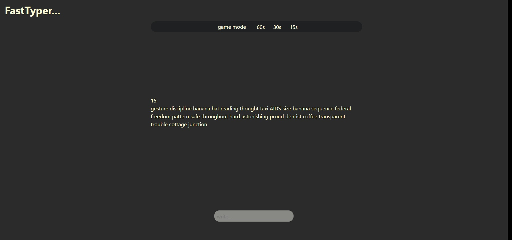
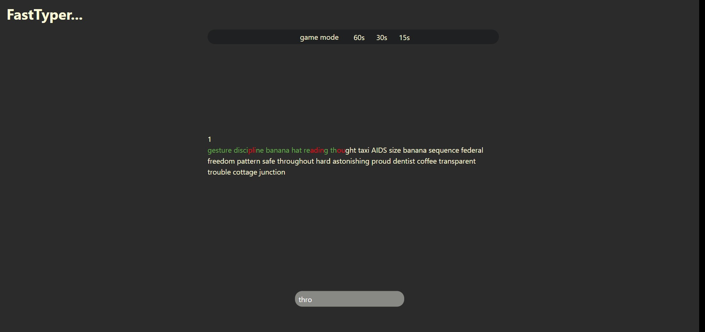
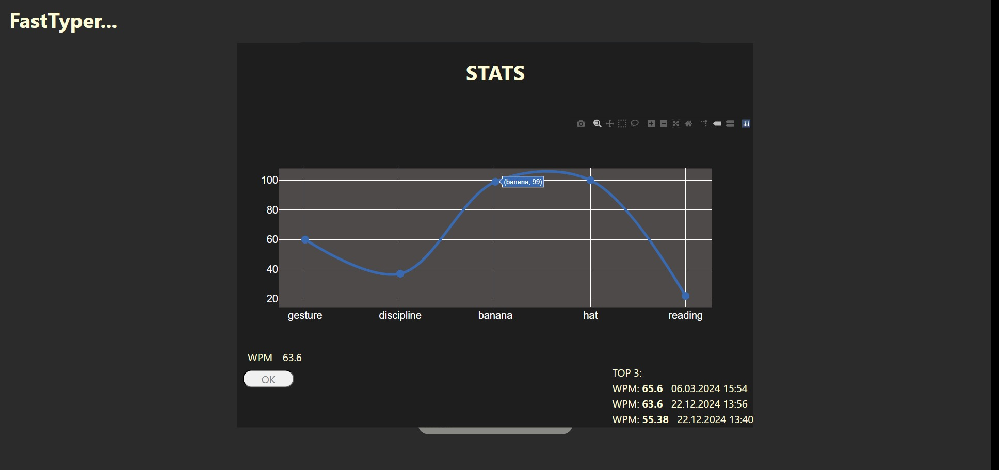
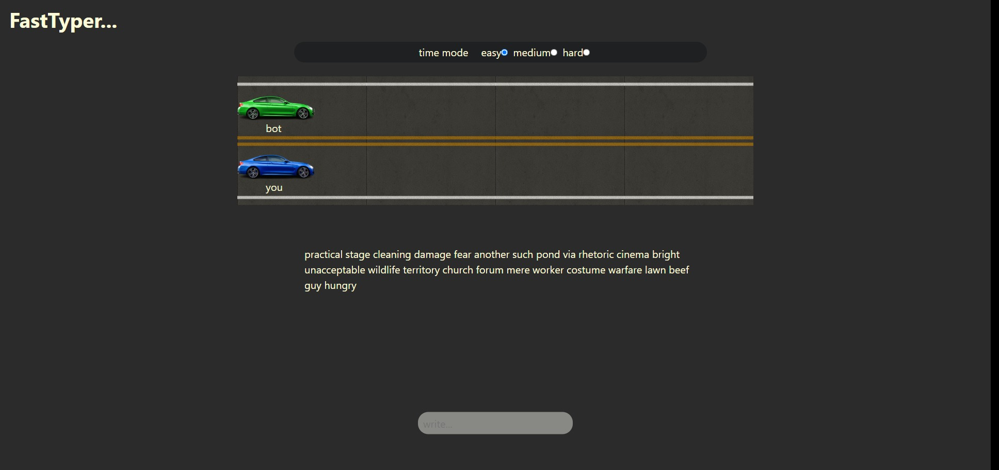
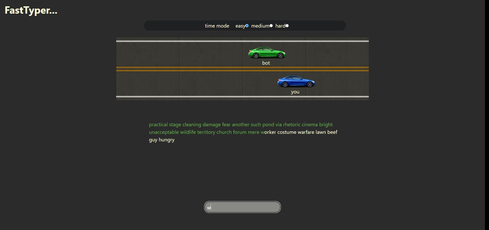
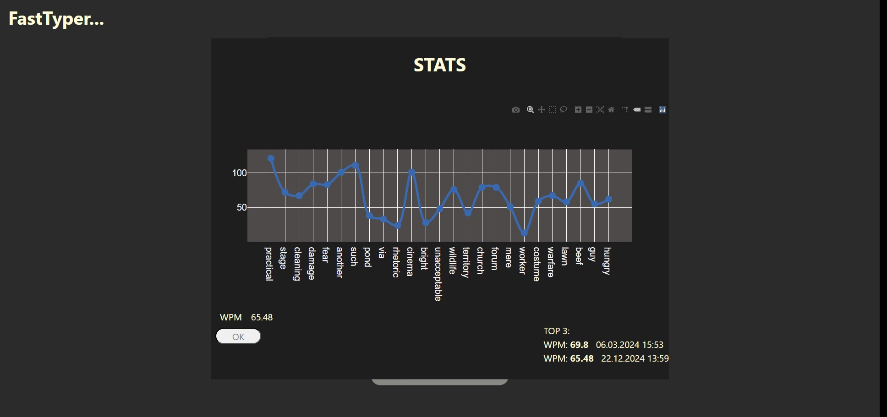
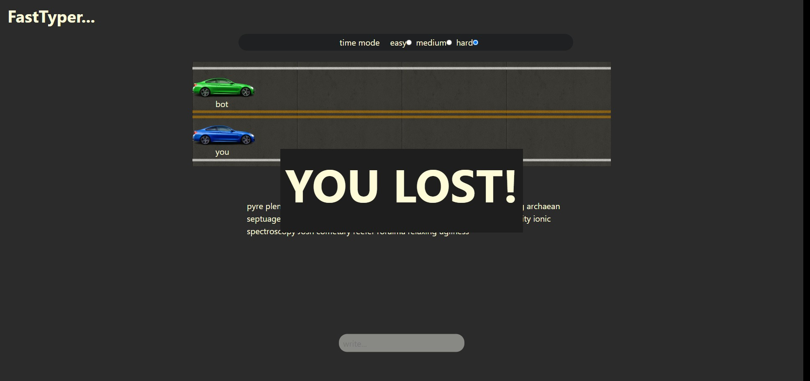

# FastTyper
Final project for course *Python Programming Language*, taught at [PEF MENDELU](https://pef.mendelu.cz/), graded 40/40 points
## Description
This project is an alternative to [TypeRacer](https://play.typeracer.com/), designed to help users improve their typing speed and accuracy. The web app offers two engaging modes:  

### 1. Time Mode  
Test your typing speed within a set time limit of **15, 30, or 60 seconds**. Mistakes are allowed and are factored into the final WPM (Words Per Minute) score. The round ends when the timer runs out.  

### 2. Game Mode  
Compete against a bot in a racing game! Your typing moves your car forward while the bot moves at a fixed speed based on the selected difficulty. No mistakes allowed  
- **Higher difficulty**: Faster bots and more challenging words.  
- **Objective**: Outpace the bot and win the race!  

### End of round 
At the end of each round (unless you fail to beat the bot), you'll see detailed statistics, including:  
- Chart with WPM for each word  
- Your WPM for the whole round  
- The **Top 3 WPM scores**

## Technology Stack  
- **Core Logic**: Developed in Python, seamlessly integrated with the web using [PyScript](https://pyscript.net/).  
- **Web Interface**: Built with simple yet effective HTML and CSS for an accessible and clean design.  
## Authors

- [David Krčmář](https://www.linkedin.com/in/david-krcmar-943182235/)
- [Jiří Daniel Šuster](https://www.linkedin.com/in/ji%C5%99%C3%AD-daniel-%C5%A1uster-7017b0306/)

## Screenshots

## License

[MIT](https://choosealicense.com/licenses/mit/)

